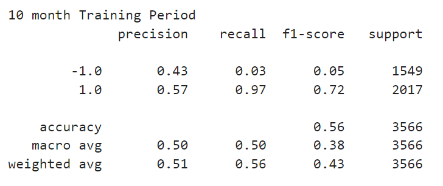

# Tuning_and_Testing_Trading
Creates a baseline trading algorithm based on Support Vector Machines. Tries to optimize the trading algorithm by adjusting training size, parameters and training models. Creates a report to showcase the differences in machine learning models and their effect on returns.


---

## Technologies

Language: Python 3.9.12

Libraries used:

[Pandas](https://pandas.pydata.org/pandas-docs/stable/index.html) - For the creation and visualization of Data Frames

[Jupyter Labs](https://jupyter.org/) - An ipython kernel for interactive computing in python

[PyViz hvPlot](https://hvplot.holoviz.org/index.html) - A high level python library for interactive data visualization

[Matplot Lib](https://matplotlib.org/) - Library used for creating plots and visualizations

[Scikit-Learn](https://scikit-learn.org/0.18/auto_examples/svm/plot_iris.html) - Powerful machine learning library


---

## Installation Guide

If you are using an anaconda or a conda environment (which is highly recommended) chances are pandas, hvplot and jupyter labs are already installed in your virtual environment. 

For a full install activate a conda development environment and run in GitBash if not already installed, otherwise conda can be used:
```python
    conda install pandas
    conda install jupyterlab
    conda install -c conda-forge matplotlib
    conda install -c pyviz hvplot
    conda conda install scikit-learn
```


Check the to make sure everything has been installed properly
```python
    conda list pandas
    conda list jupyter lab
    conda list scikit-learn
    conda list matplotlib
    conda list hvplot
```


---

## Usage

To run this jupyter lab notebook you will need to use GitBash and navigate to where you have exported the files associated with this project and activate your dev environment.
Initiate jupyter lab on a local server by  using the following commands:

```python
    conda activate 'your-dev-environment'
    jupyter lab
```

Next, this project can be ran by navigating to the **machine_learning_trading_bot_main.ipynb** jupyter notebook file and clicking the double arrow as seen below:


This will run the 'main' jupyter notebook and each cell has pseudocode instructing the viewer as to what is happening. Additionally, the markdown cells provide clues to the viewer as to what the purpose of the different sections of this project entail. The 'main' jupyter notebook reuses the initial code to create the differently tuned models. 
This however was creating a very long and complicated notebook file. 

The differently tuned models are broken up into separate jupyter notebook files for easier distinguishability, but are also included in the main notebook. 

**machine_learning_trading_bot_sma_window.ipynb** - tests shorter and longer SMA windows for tuning.

**machine_learning_trading_bot_test_diff_algorithm.ipynb** - tests a different classifier for tuning.

**machine_learning_trading_bot_test_diff_training_period.ipynb** - tests a longer training period


---

## Overview of Project

## Baseline Model
This model aims to predict a signal to either buy a stock when returns are predicted to be positive or to sell a stock short when returns are predicted to be negative.

A simple moving average with a short rolling window of 4 days and a longer rolling window of 100 days are the two classifiers used in a Support Vector Machines model to make the predictions. The training window is taken from the first 3 months of data points and the testing window is taken from the 3 month mark to the end of the dataset. 

## Different Training Size
The baseline model is tuned to take the first 10 months of the dataset as the training set and the remainder for the testing set. 

## SMA Periods Extended
This tuned version of the model uses a short SMA period of 50 and and longer period of 175 to try and predict the trading signal. Another SVM model uses SMA windows of 3 and 25 to make predictions. This tests whether increasing or decreasing the SMA window has an effect on predictability.

## New Machine Learning Classifier
A Multi-Layer Perceptron Classifier model is invoked instead of the Support Vector Machines Classifier. This classifier is an easier neural network model compared to creating your own dense layers using TensorFlow. 


---
# Summary - Evaluation Report

## Baseline Model
 

Here we have the baseline model that has an accuracy score of 55% and strategy returns greater than the actual returns.

## Different Training Size
 

Here with a longer training period we have an accuracy score of 56% and a higher precision and f1 score a percent higher than baseline. It has report scores very similar to the baseline, however it looks like the cummulative return values for the trading strategy were less than the atual returns.

## SMA Periods Extended
### Long Period
 
This tuned model had confusion matrix scores similar to the baseline performance. This trading tradegy closely mimed the actual returns, until something turned for the worse and the trading strategy ended up below the actual returns.


### Short Period
 
This model performed very similarly to the baseline module, except it had a significantly higher recall score. The baseline model only had a recall score of 4% to predict the short sell, but the shorter sma period module had a 13% recall score almost doubling its ability to sell short. This module was a much more even keeled model compared to the original trading strategy. 


## New Machine Learning Classifier
 

This model looks like it performed better than the baseline model if it had been cut off at a certain point where the cummulative returns were maximized. However, toward the end of the date range, the cummulative returns of this strategy went right back down to the original returns. This model would need some outside intervention to call the right moment to sell. It did have the most balanced accuracy, precision, recall and f1 scores for the -1 prediction compared to the +1 prediction. 

## Conclusion
Based on the more even keeled strategy of the shorter SMA window and the greater returns of the new MLP classifier model, tuning the strategy in these two ways seems to be a better option than the original trading strategy. 


---

## Contributors

Created by Silvano Ross while in the UW FinTech Bootcamp
> Contact Info:
> email: silvanoross3@gmail.com |
> [GitHub](https://github.com/silvanoross) |
> [LinkedIn](https://www.linkedin.com/in/silvano-ross-b6a15a93/)


---

## License

- [MIT](LICENSE)
